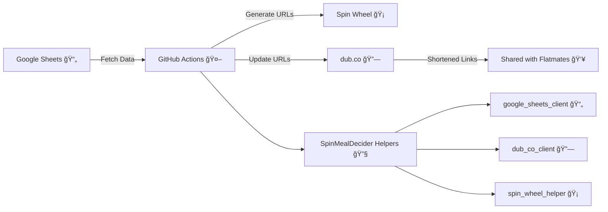

# SpinMealDecider 🍽️🎡

**SpinMealDecider** is an automated tool that transforms shared meal menus into interactive spin wheels, using Google Sheets and dub.co for easy decision-making and sharing among flatmates. 📊📈🔗

## Problem Statement ✨

Managing meal choices and making decisions collaboratively can often be a hassle. Our project, **SpinMealDecider**, provides an interactive and fun solution. It automates the creation of meal decision-making spin wheels from a shared Google Sheet, updates dynamic URLs, and uses `dub.co` for easy sharing among flatmates. 🤝📝

### The Dilemma We All Face 🌀

_Choosing what to eat can be tougher than it seems!_

## Proposed Solution 💡

The SpinMealDecider project automates the following processes:

1. **Data Collection:** Read the food menu for each meal (breakfast, lunch, dinner) from a shared Google Sheet. 📄🍳🥗🍛
2. **URL Creation:** Generate dynamic URLs to display these options in a spin-wheel format using [Unfair Spin Wheel](https://unfair.spin-wheel.click). 🔄🌐
3. **URL Shortening:** Use `dub.co` API to shorten these URLs for convenient sharing. 📪✂️

### Sample Google Sheet Format and Expected Outcome

Below is an example showing how your Google Sheet should be structured for each meal. Each sheet should have `label` and `weight` columns. Alongside is a sample outcome demonstrating what the spin wheel URL looks like once generated:

  
  

- **Sample Spin Wheel URL:** [Unfair Spin Wheel](https://unfair.spin-wheel.click)

### Solution Architecture 🏗️

## Setup Instructions

For detailed instructions on setting up the project for development and running it locally or within a Docker environment, please refer to [DEVELOPMENT.md](DEVELOPMENT.md).
